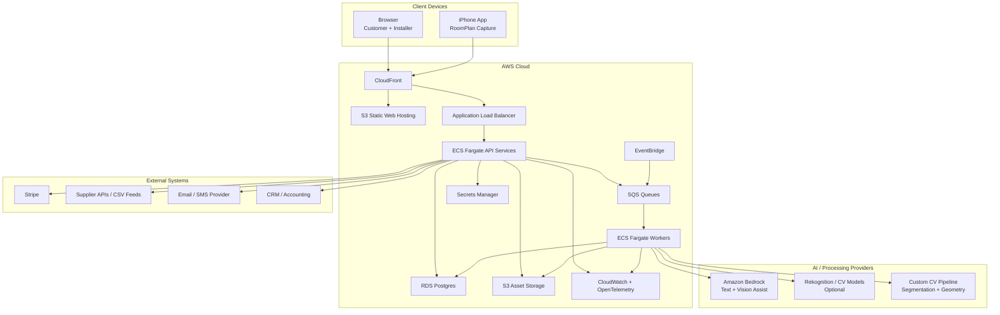

# Flooring Quote Automation System: Technical Architecture

## Purpose

This document describes a high-level technical architecture for a flooring quote automation platform. It is intended to sit alongside the business concept document and explain how the system could be built without diving into implementation detail.

The architecture supports three input paths:

- iPhone room scan using Apple RoomPlan / LiDAR;
- uploaded room photographs;
- uploaded 2D floor plans or sketches.

The output is a quote-ready project record containing room measurements, selected flooring products, estimated material requirements, indicative job duration, customer details, and installer next steps.

## Architecture Goals

- Make customer intake simple from mobile or web.
- Convert spatial inputs into structured project data.
- Support real flooring products, colours, finishes, and pricing.
- Generate indicative quotes and material order lists.
- Help installers qualify leads, approve quotes, order products, and plan work.
- Keep the architecture modular so scanning, AI, quoting, and supplier integrations can evolve independently.
- Deploy cleanly on AWS with a path from MVP to scale.

## High-Level System View

The system should be understood as a shared project workspace, not a simple left-to-right pipeline.

The customer experience, installer dashboard, spatial processing, catalogue, quote engine, ordering workflow, and communications layer all read from and write back to the same project record. That project record is the operational centre of the product: it carries the customer intent, room evidence, selected products, measurement confidence, quote assumptions, approval state, order pack, and job plan.

```mermaid
flowchart TB
  CUSTOMER["Customer\nhomeowner or renovator"]
  INSTALLER["Installer\nsales + operations"]

  subgraph Experience["Experience Layer"]
    INTAKE["Customer Intake\nroom details, budget, photos"]
    PRODUCT_UI["Product Selection\nflooring, colour, finish"]
    CUSTOMER_STATUS["Customer Status Page\nquote range, next steps"]
    DASHBOARD["Installer Dashboard\nlead review, quote approval, jobs"]
  end

  subgraph Core["Core Application"]
    PROJECT["Project Record\ncustomer, rooms, assets, status"]
    ROOM_MODEL["Room Model\nareas, openings, confidence"]
    SELECTED_PRODUCTS["Selected Products\npacks, underlay, trims"]
    QUOTE["Quote Engine\nmaterials, labour, waste, duration"]
    ORDER_PACK["Order Pack\nsupplier-ready material list"]
    JOB_PLAN["Job Plan\nschedule estimate, notes, tasks"]
  end

  subgraph Spatial["Spatial Capture And AI"]
    ROOMPLAN["RoomPlan Import\niPhone LiDAR / USDZ"]
    PHOTO_AI["Photo Analysis\nfloor segmentation, complexity"]
    PLAN_AI["Floor Plan Parsing\nPDF, image, sketch"]
    NORMALISE["Spatial Normalisation\ncommon room schema"]
    AI_REVIEW["AI Review Assist\nflags, explanations, assumptions"]
  end

  subgraph Catalogue["Catalogue And Pricing"]
    CATALOGUE["Product Catalogue\nproducts, colours, finishes"]
    PRICING["Installer Pricing Rules\nlabour, mark-up, waste"]
    SUPPLIER_FEEDS["Supplier Feeds\nCSV/API availability"]
  end

  subgraph Platform["Platform Services"]
    API["API Layer\nauth, validation, project APIs"]
    DB["Postgres\nstructured project data"]
    ASSETS["Object Storage\nphotos, scans, plans, PDFs"]
    QUEUE["Event Queue\nasync processing jobs"]
    OBSERVE["Observability\nlogs, traces, failures"]
  end

  subgraph Integrations["Commercial Integrations"]
    SUPPLIERS["Supplier Ordering\nmaterials and availability"]
    PAYMENTS["Payments\nquote acceptance, deposits"]
    COMMS["Email / SMS\nupdates and reminders"]
    CRM["CRM / Accounting\noptional export"]
  end

  CUSTOMER --> INTAKE
  CUSTOMER --> PRODUCT_UI
  CUSTOMER --> CUSTOMER_STATUS
  INSTALLER --> DASHBOARD

  INTAKE --> API
  PRODUCT_UI --> API
  CUSTOMER_STATUS --> API
  DASHBOARD --> API

  API <--> PROJECT
  PROJECT <--> ROOM_MODEL
  PROJECT <--> SELECTED_PRODUCTS
  PROJECT <--> QUOTE
  QUOTE --> ORDER_PACK
  QUOTE --> JOB_PLAN
  ORDER_PACK --> PROJECT
  JOB_PLAN --> PROJECT

  INTAKE --> ASSETS
  ASSETS --> QUEUE
  QUEUE --> ROOMPLAN
  QUEUE --> PHOTO_AI
  QUEUE --> PLAN_AI
  ROOMPLAN --> NORMALISE
  PHOTO_AI --> NORMALISE
  PLAN_AI --> NORMALISE
  NORMALISE --> ROOM_MODEL
  AI_REVIEW --> QUOTE
  AI_REVIEW --> DASHBOARD

  CATALOGUE --> PRODUCT_UI
  CATALOGUE --> SELECTED_PRODUCTS
  PRICING --> QUOTE
  SUPPLIER_FEEDS --> CATALOGUE

  PROJECT <--> DB
  ROOM_MODEL <--> DB
  SELECTED_PRODUCTS <--> DB
  QUOTE <--> DB
  ORDER_PACK <--> DB
  JOB_PLAN <--> DB

  ORDER_PACK --> SUPPLIERS
  QUOTE --> PAYMENTS
  PROJECT --> COMMS
  ORDER_PACK --> CRM
  API --> OBSERVE
  QUEUE --> OBSERVE
```

## Interconnectedness Model

The important design point is that the system keeps every workflow tied to one shared source of truth.

| System area | Reads from | Writes back |
|---|---|---|
| Customer intake | Product catalogue, installer branding, pricing guardrails | Contact details, address/suburb, budget, room photos, scan files, floor plans |
| Spatial processing | Uploaded assets, RoomPlan exports, manual dimensions | Room model, confidence scores, review flags, extracted measurements |
| Product selection | Catalogue, availability, selected room type, budget signal | Selected products, alternates, style preferences, price sensitivity |
| Quote engine | Room model, products, pack sizes, labour rules, waste factors, complexity flags | Quote range, assumptions, exclusions, material quantities, job duration estimate |
| Installer dashboard | Project record, quote, confidence flags, selected products | Manual overrides, approved quote, follow-up notes, booking state |
| Ordering workflow | Approved quote, selected products, supplier mappings | Order pack, supplier request, missing-item flags, fulfilment notes |
| Customer communications | Project status, quote state, booking state | Customer responses, approval events, reminder history |

That feedback loop is what makes the product commercially useful. A generic visualizer ends when the customer sees a floor style in a room. This system continues into quote review, approval, product ordering, job planning, and customer follow-up.

## End-To-End Flow

### 1. Customer Starts A Project

The customer lands on the installer website and creates a project enquiry.

They can provide:

- contact details;
- address or suburb;
- room type;
- rough budget;
- preferred flooring type;
- photos, scans, or floor plans.

The system creates a project record and stores original uploaded assets.

### 2. Spatial Capture Or Upload

Input options:

- **iPhone RoomPlan scan**: customer scans a room with a supported iPhone/iPad. The mobile app exports a structured room model.
- **Photo upload**: customer uploads one or more room photos. The system uses AI-assisted detection to identify floor area and likely complexity.
- **2D floor plan upload**: customer uploads a floor plan image, PDF, or sketch. The system extracts or assists with room dimensions.

The goal is not perfect automation from day one. The system should track confidence and allow installer review.

### 3. Spatial Normalisation

All input types are converted into a common project model:

- room dimensions;
- floor area;
- perimeter;
- openings;
- stairs or transitions if known;
- confidence score;
- manual review flags;
- source assets.

This gives the quote engine a consistent input regardless of how the customer submitted the room.

### 4. Product Selection

The customer browses products from the installer catalogue or supplier feed.

Product records include:

- product type;
- colour;
- finish;
- plank dimensions;
- pack size;
- price per square metre or pack;
- installation method;
- compatible underlay or accessories;
- availability if supplier integration exists.

### 5. Quote Generation

The quote engine combines:

- room area;
- waste factor;
- flooring type;
- pack size;
- underlay;
- trims;
- adhesives or accessories;
- labour rate;
- preparation assumptions;
- complexity factors;
- installer pricing rules.

It generates:

- indicative customer quote range;
- installer-facing estimate;
- material quantity estimate;
- expected job duration;
- confidence score;
- assumptions and exclusions.

### 6. Quote Review And Approval

The installer reviews the quote, adjusts assumptions, and sends a polished quote to the customer.

Once approved, the quote becomes the source of truth for:

- selected products;
- ordered quantities;
- labour estimate;
- scheduling;
- customer expectations.

### 7. Ordering And Job Planning

The approved quote produces an order pack:

- flooring packs;
- underlay;
- trims;
- adhesives;
- transition profiles;
- other job-specific accessories.

The installer can place supplier orders, track order status, and plan the work based on estimated job duration.

## AWS Deployment View

## AWS Service Mapping

| Capability | AWS / Platform Component | Purpose |
|---|---|---|
| Customer and installer web app | CloudFront + S3 | Fast public web delivery |
| API services | ECS Fargate behind ALB | Project, quote, catalogue, user, ordering APIs |
| Async processing | SQS + ECS workers | Scan parsing, image processing, quote jobs, reports |
| Scheduled jobs | EventBridge | Supplier sync, stale quote reminders, reporting |
| Relational data | RDS Postgres | Projects, quotes, products, users, jobs |
| File storage | S3 | Photos, RoomPlan exports, floor plans, quote PDFs |
| Secrets | Secrets Manager | Supplier, payment, AI provider credentials |
| AI assistance | Bedrock / external LLMs | Product classification, notes, customer explanations |
| Computer vision | Custom CV pipeline / Rekognition / model endpoint | Floor detection, plan parsing, confidence scoring |
| Observability | CloudWatch + OpenTelemetry | Logs, traces, job failures, cost visibility |
| Payments | Stripe | Deposits, quote acceptance, subscriptions |
| Notifications | SES/SNS/Twilio or equivalent | Customer and installer updates |

## Key Domain Components

### Customer Intake

Captures the customer journey from enquiry through quote request. It should work well on mobile and support partial completion so customers can return later.

### Spatial Processing

Converts room scans, photos, and plans into a common measurement model. The system should preserve the original inputs, extracted data, confidence scores, and manual override history.

### Product Catalogue

Maintains flooring products, colours, finishes, price data, pack sizes, and supplier details. Catalogue quality is central because quoting accuracy depends on product metadata.

### Quote Engine

Combines spatial data, product data, installer pricing rules, labour assumptions, and complexity flags into an indicative quote and installer-facing estimate.

### Ordering Workflow

Turns an approved quote into a material order list. This is where the system moves beyond lead capture into real operational value.

### Installer Dashboard

Shows enquiries, quote status, customer selections, room data, assumptions, order packs, job duration estimates, and follow-up actions.

## Product Surface Mockups

A first-pass visual mockup board is available at:

- [`flooring-quote-app-mockups.html`](./flooring-quote-app-mockups.html)
- [`flooring-quote-mobile-mockups.html`](./flooring-quote-mobile-mockups.html)

The mockups cover four core product surfaces across desktop and phone layouts:

1. **Customer intake and room upload**: the customer describes the room, budget, current floor, and uploads photos or a scan.
2. **Product selection and indicative range**: the customer compares flooring products, sees a room preview, and receives an indicative installed range.
3. **Installer lead review**: the installer reviews extracted measurements, confidence flags, quote assumptions, and manual adjustments before sending a polished quote.
4. **Approved quote to order pack**: the accepted quote becomes an operational order list and job-planning record.

These are intentionally web-first. The MVP should not depend on a native iPhone scanning app. RoomPlan capture can be added later as a richer input channel once the customer and installer workflow is proven.

## Scaling Model

The system scales by separating synchronous user experience from asynchronous processing.

Synchronous:

- customer intake;
- product browsing;
- quote review;
- installer dashboard.

Asynchronous:

- image analysis;
- RoomPlan import processing;
- floor plan extraction;
- supplier catalogue sync;
- quote PDF generation;
- notifications;
- reporting.

This allows the MVP to run cheaply while giving a clear path to scale as uploads, supplier data, and quote volume increase.

## MVP Architecture

The first commercial MVP does not need full iPhone scanning or perfect AI measurement.

Recommended MVP:

- web intake form;
- room photo upload;
- manual dimension entry;
- product catalogue;
- quote calculator;
- installer dashboard;
- approved quote to material order pack;
- job duration estimate based on rules;
- PDF/email quote output.

Then add:

- iPhone RoomPlan capture;
- AI-assisted photo measurement;
- 2D floor plan parsing;
- supplier API integration;
- payment/deposit collection;
- scheduling and customer status updates.

## Risks And Design Considerations

- Measurement accuracy must be transparent; use confidence scores and installer review.
- Product catalogue data can be messy; onboarding tools matter.
- Supplier integrations may begin as CSV imports before APIs.
- The system should avoid making final fixed-price promises without installer approval.
- Photos and scans are sensitive customer data; storage, retention, and access control need to be designed carefully.
- The quoting model should preserve assumptions so disputes can be traced back to source inputs.

## Suggested Diagram Use

For the investor document, use the AWS deployment view as the technical diagram and the end-to-end workflow as the business process diagram.

The business message:

> Customer input becomes structured project data, structured project data becomes a quote, an approved quote becomes an order pack and job plan.
